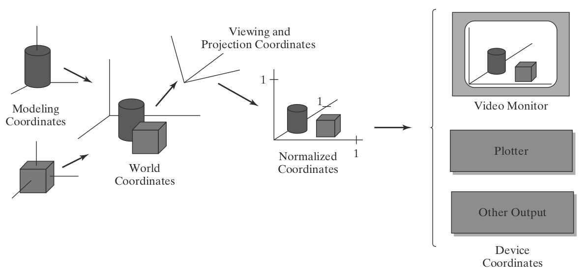
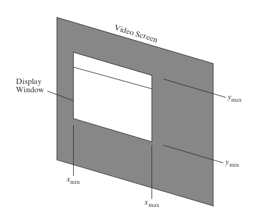
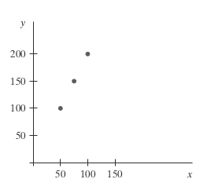
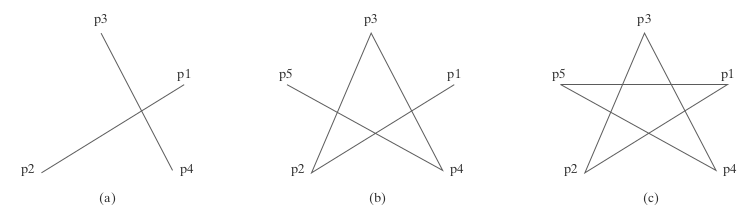

# **Introduction to Graphics Libraries**
## ...

https://talks.obedmr.com/


---

## 2 types of Computer Graphics Software

- Special-purpose packages
  - For nonprogrammers
  - To generate pictures, graphs or charts
  - Without worrying about the programming
- General programming packages
  - Libraries and graphics functions
  - Typical functions: points, straight lines, polygons, spheres, ...
  - Programmable color values, view of scene, rotations, transformations, ...

---

## Quick questions

### ... about Graphics Software

- Could you list some special-purpose graphics packages?

- Could you list some general programming packages?


---


## Coordinates Representations




----

## Graphics functions

- Primitives (_points, lines, curved lines, polygons, shapes, ..._)
- Attributes (_color, style, area-filling patterns, ..._)
- Geometric transformations (_size, position, orientation, ..._)
- Modeling transformations (_individual object descriptions with local coordinates, ..._)
- Viewing transformations (_projections, screen display, lighting, ..._)
- Input functions (_control and process of data frow from input devices_)

---


## Libraries and APIs: Standards

- Graphical Kernel System (GKS) - 1984
  - Initially, a 2-dimensional graphics package
- Programmer’s Hierarchical Interactive Graphics System (PHIGS)
  - Hierarchical object modeling, color specifications, surface rendering, and picture manipulations
- GL - Graphics Library (Silicon Graphics Inc.)
  - Used in the first graphics workstations
- OpenGL - a hardware independent version of GL (1990)

---


## Other Graphics Packages

- [Open Inventor Toolkit](https://www.openinventor.com/)
- [jMonkey Enginge](https://jmonkeyengine.org/)
- [Unreal Engine](https://www.unrealengine.com/en-US)
- [Unity Engine](https://unity.com/products/unity-engine)
- [ModernGL](https://moderngl.readthedocs.io/en/latest/)
- [PyGame](https://www.pygame.org/news)
- [Processing](https://processing.org/)
- ... [Vulcan](https://www.vulkan.org/), [SDL](https://www.libsdl.org/), [DirectX](https://devblogs.microsoft.com/directx/) and **hundreds** more ...

---


## OpenGL - Introduction

- *Computer Graphics with OpenGL* _by Hearn, Baker and Carithers_
  - Chapter 2, sections 5

---


## OpenGL - Install and Setup

- Linux (Debian-based)
  ```
  sudo apt-get install freeglut3-dev
  ```
- Windows (_mmm, a bit painful_)
  - http://graphx-opengl-win.obedmr.com
- MacOS (_same as Windows but MacOS, you know it_)
  - http://graphx-opengl-mac.obedmr.com
- Virtual Machine (_it serves for the purpose of first test_)
  - https://www.virtualbox.org/

---

# ModernGL

https://moderngl.readthedocs.io/en/latest/


---

# PyGame

https://www.pygame.org/news


---

# Processing

https://processing.org/

---


## Code Challenge: First program in OpenGL*

- Go to http://graphx-chlg1.obedmr.com and read about line drawing algorithms
- Create a program with OpenGL that:
  - Given 2 points in the format `(x, y)`,
  - develop a function `myLine` that will generate a list points that will represent a line
  - and then will draw them in the screen with the `glVertex2i` function
- You can take a look on [./src/opengl/hello-OpenGL.cpp](./src/opengl/hello-OpenGL.cpp)

---


# Primitives

### World-coordinate reference frame

```
glMatrixMode (GL_PROJECTION);
glLoadIdentity ( );
gluOrtho2D (xmin, xmax, ymin, ymax);
```



---


### Primitives - Points

```
glBegin (GL_POINTS);
  glVertex2i (50, 100);
  glVertex2i (75, 150);
  glVertex2i (100, 200);
glEnd ( );
```

- Values can be in 2, 3 or 4 dimensions
- Numerical data types can be i(integer), s(short), f(float) or d(double)
- _More at 3.3 section (book)_



---


### Primitives - Lines

```
glBegin (GL_LINES);        glBegin (GL_LINE_STRIP);        glBegin (GL_LINE_LOOP);
  glVertex2iv (p1);          glVertex2iv (p1);               glVertex2iv (p1);
  glVertex2iv (p2);          glVertex2iv (p2);               glVertex2iv (p2);
  glVertex2iv (p3);          glVertex2iv (p3);               glVertex2iv (p3);
  glVertex2iv (p4);          glVertex2iv (p4);               glVertex2iv (p4);
  glVertex2iv (p5);          glVertex2iv (p5);               glVertex2iv (p5);
glEnd ( );                 glEnd ( );                      glEnd ( );
```



---

### Primitives - attributes

- Basically, it's about the way a primitive is to be displayed.
- Some attribute parameters, such as color and size, determine the fundamental characteristics of a primitive.
- _More about it on Chapter 4 from the Book_
  - Consider reading it because you'll need in the coming challenges

---


# User Interface & Events

### Logical classification of Input Devices

- **Locator** - A device for specifying one coordinate position.
- **Stroke** - A device for specifying a set of coordinate positions.
- **String** - A device for specifying text input.
- **Valuator** - A device for specifying a scalar value.
- **Choice** - A device for selecting a menu option.
- **Pick** - A device for selecting a component of a picture.

---


### User Interface & Events - Input modes

- In **request mode**, the application program initiates data entry. When input values are requested, processing is suspended until the required values are received.
- In **sample mode**, the application program and input devices operate independently. Input devices may be operating at the same time that the program is processing other data.
- In **event mode**, the input devices initiate data input to the application program. The program and the input devices again operate concurrently, but now the input devices deliver data to an input queue, also called an _event queue_.

---


### User Interface & Events - Mouse callback example

- Go to [./src/opengl/mousePtPlot.cpp](./src/opengl/mousePtPlot.cpp)

---


## Challenge: Polygons drawing

By using [`mousePtPlot.cpp`](./src/opengl/mousePtPlot.cpp) and also  [`polygon.cpp`](./src/opengl/polygon.cpp) create a new `polygons.cpp` program with the following specs:

- By default the program will start drawing a random-color filled pentagon (5 sides)
- Then, for every left-button mouse click, the polygon will increase its sides by one and it will be filled with a new random color
- The maximun number of sides is 12
- Once your program reach the maximum number of sides, it will go back to the pentagon

---


## Challenge: Polygons drawing - useful info

_**Chapters 3, 4 and 18** from the book can be very useful. Consider taking a look on those chapters_

---

# Resources and Credits
This material is genereated thanks to some extracts from following resources:

- **Computer Graphics with OpenGL** (Chapters 2, 3, 4, 18) by _Donald D. Hearn/M. Pauline Baker, Warren Carithers_, 4th Edition


---

# Thanks

- **Obed N Muñoz Reynoso**
	- Cloud Software Engineer
	- obed.n.munoz@``gmail | tec | intel``.com
