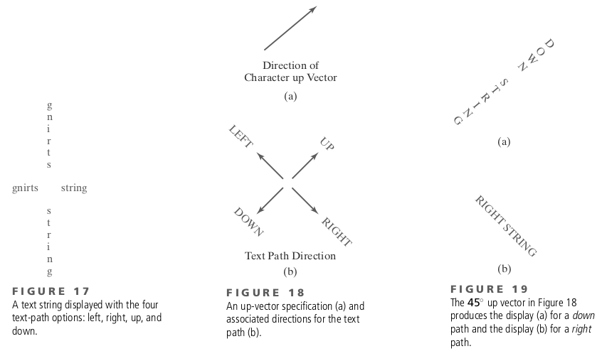

# **Introduction to Graphics Libraries**
## ...

https://talks.obedmr.com/


---

## 2 types of Computer Graphics Software

- Special-purpose packages
  - For nonprogrammers
  - To generate pictures, graphs or charts
  - Without worrying about the programming
- General programming packages
  - Libraries and graphics functions
  - Typical functions: points, straight lines, polygons, spheres, ...
  - Programmable color values, view of scene, rotations, transformations, ...

---

## Quick questions

### ... about Graphics Software

- Could you list some special-purpose graphics packages?

- Could you list some general programming packages?


---


## Coordinates Representations


----

## Graphics functions

- Primitives (_points, lines, curved lines, polygons, shapes, ..._)
- Attributes (_color, style, area-filling patterns, ..._)
- Geometric transformations (_size, position, orientation, ..._)
- Modeling transformations (_individual object descriptions with local coordinates, ..._)
- Viewing transformations (_projections, screen display, lighting, ..._)
- Input functions (_control and process of data frow from input devices_)

---


## Libraries and APIs: Standards

- Graphical Kernel System (GKS) - 1984
  - Initially, a 2-dimensional graphics package
- Programmer’s Hierarchical Interactive Graphics System (PHIGS)
  - Hierarchical object modeling, color specifications, surface rendering, and picture manipulations
- GL - Graphics Library (Silicon Graphics Inc.)
  - Used in the first graphics workstations
- OpenGL - a hardware independent version of GL (1990)

---


## Other Graphics Packages

- [Open Inventor Toolkit](https://www.openinventor.com/)
- [jMonkey Enginge](https://jmonkeyengine.org/)
- [Unreal Engine](https://www.unrealengine.com/en-US)
- [Unity Engine](https://unity.com/products/unity-engine)
- [ModernGL](https://moderngl.readthedocs.io/en/latest/)
- [PyGame](https://www.pygame.org/news)
- [Processing](https://processing.org/)
- ... [Vulcan](https://www.vulkan.org/), [SDL](https://www.libsdl.org/), [DirectX](https://devblogs.microsoft.com/directx/) and **hundreds** more ...

---


# Primitives

## World-coordinate reference frame

```
glMatrixMode (GL_PROJECTION);
glLoadIdentity ( );
gluOrtho2D (xmin, xmax, ymin, ymax);
```


---


## Primitives - Points

```
glBegin (GL_POINTS);
  glVertex2i (50, 100);
  glVertex2i (75, 150);
  glVertex2i (100, 200);
glEnd ( );
```

- Values can be in 2, 3 or 4 dimensions
- Numerical data types can be i(integer), s(short), f(float) or d(double)
- _More at 3.3 section (book)_


---


### Primitives - Points (2/3)


- Points as arrays

```
int point1 [ ] = {50, 100};
int point2 [ ] = {75, 150};
int point3 [ ] = {100, 200};
```

-  Plotting the 3 points

```
glBegin (GL_POINTS);
  glVertex2iv (point1);
  glVertex2iv (point2);
  glVertex2iv (point3);
glEnd ( );
```

---


### Primitives - Points (3/3)

- 3D points

```
glBegin (GL_POINTS);
  glVertex3f (-78.05, 909.72, 14.60);
  glVertex3f (261.91, -5200.67, 188.33);
glEnd ( );
```

- You can also define a point a a C++ class or a structure (`struct`)

```
class wcPt2D {
public:
  GLfloat x, y;
};
```

---


## Primitives - Lines

```
glBegin (GL_LINES);        glBegin (GL_LINE_STRIP);        glBegin (GL_LINE_LOOP);
  glVertex2iv (p1);          glVertex2iv (p1);               glVertex2iv (p1);
  glVertex2iv (p2);          glVertex2iv (p2);               glVertex2iv (p2);
  glVertex2iv (p3);          glVertex2iv (p3);               glVertex2iv (p3);
  glVertex2iv (p4);          glVertex2iv (p4);               glVertex2iv (p4);
  glVertex2iv (p5);          glVertex2iv (p5);               glVertex2iv (p5);
glEnd ( );                 glEnd ( );                      glEnd ( );
```


---


## Let's code: Lines Art Drawing

Go to [`cg-linesArt`](https://github.com/CodersSquad/cg-linesArt/tree/main) for instructions.

---

## Primitives - Curves

*This will be seen on [next section](../math-fundamentals/curves.html)

But, let's see the simplest way for doing curves aproximation: _by using polygons_.


---


## Primitives - Fill-Area

- An area that is filled with some solid color or pattern
- Used to describe surfaces of solid objects
- Fill regions are usually planar surfaces, mainly polygons


---


## Primitives - attributes

- Basically, it's about the way a primitive is to be displayed.
- Some attribute parameters, such as color and size, determine the fundamental characteristics of a primitive.
- _More about it on Chapter 4 from the Book_
  - Consider reading it because you'll need in the coming challenges

---


### Primitives - **point** attributes

```
glPointSize (size);
```

```
glColor3f (1.0, 0.0, 0.0);
glBegin (GL_POINTS);
  glVertex2i (50, 100);
  glPointSize (2.0);
  glColor3f (0.0, 1.0, 0.0);
  glVertex2i (75, 150);
  glPointSize (3.0);
  glColor3f (0.0, 0.0, 1.0);
  glVertex2i (100, 200);
glEnd ( );
```

---


### Primitives - **line** attributes

- Line Width

```
glLineWidth (width);
```

- Line style

```
glLineStipple (repeatFactor, pattern);
```

---


---


### Primitives - **curve** attributes


---


### Primitives - **fill-area** attributes


---


### Primitives - **character** attributes


---




---


# User Interface & Events

### Logical classification of Input Devices

- **Locator** - A device for specifying one coordinate position.
- **Stroke** - A device for specifying a set of coordinate positions.
- **String** - A device for specifying text input.
- **Valuator** - A device for specifying a scalar value.
- **Choice** - A device for selecting a menu option.
- **Pick** - A device for selecting a component of a picture.

---


### User Interface & Events - Input modes

- In **request mode**, the application program initiates data entry. When input values are requested, processing is suspended until the required values are received.
- In **sample mode**, the application program and input devices operate independently. Input devices may be operating at the same time that the program is processing other data.
- In **event mode**, the input devices initiate data input to the application program. The program and the input devices again operate concurrently, but now the input devices deliver data to an input queue, also called an _event queue_.

---


### User Interface & Events - Mouse callback example

- Go to [./src/opengl/mousePtPlot.cpp](./src/opengl/mousePtPlot.cpp)

---


## Let's code:

Go to [`cg-uiEvents`](https://github.com/CodersSquad/cg-uiEvents/tree/main) for instructions.

---

# Resources and Credits
This material is genereated thanks to some extracts from following resources:

- **Computer Graphics with OpenGL** (Chapters 2, 3, 4, 18) by _Donald D. Hearn/M. Pauline Baker, Warren Carithers_, 4th Edition


---

# Thanks

- **Obed N Muñoz Reynoso**
	- Cloud Software Engineer
	- obed.n.munoz@``gmail | tec | intel``.com
