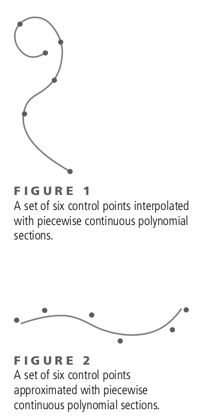
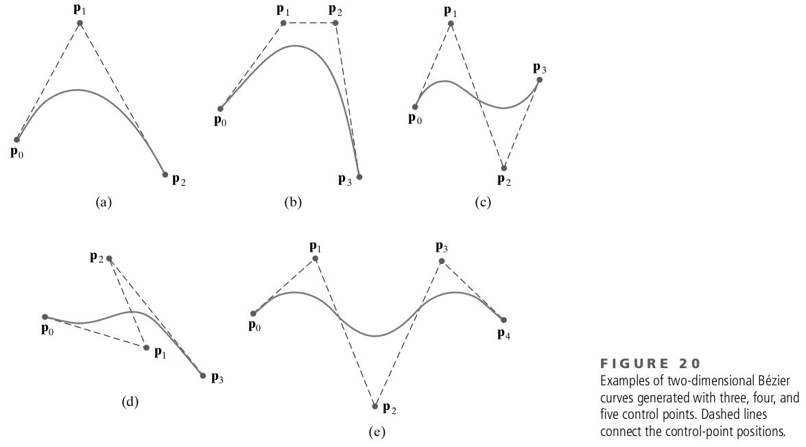
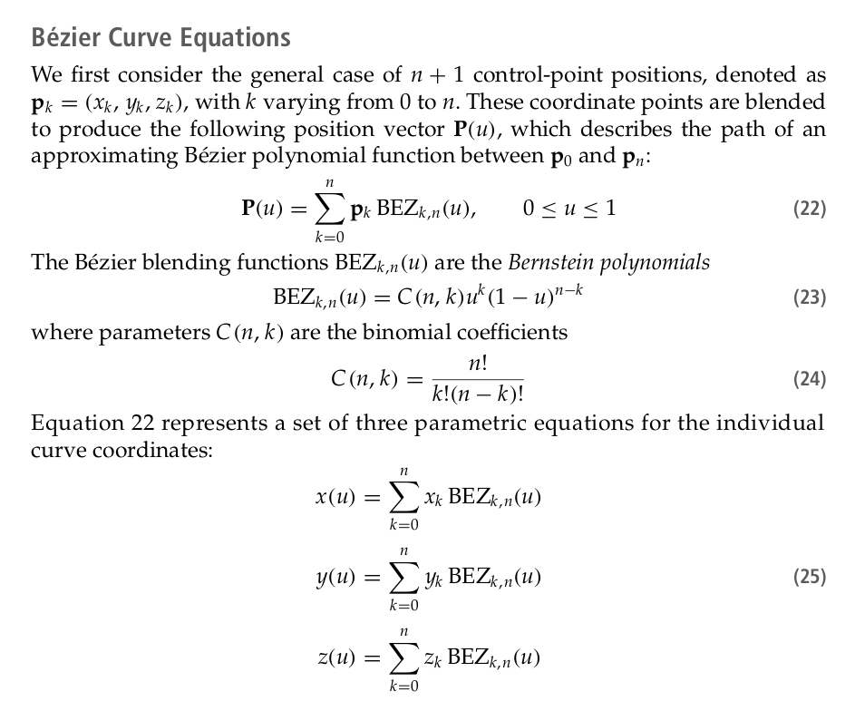
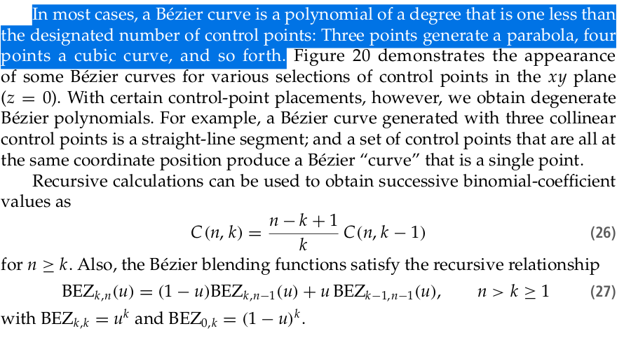

# **Math Fundamentals**
## Curves

https://talks.obedmr.com/

---

# Spline curves

- The term **spline curve** now refers to any composite curve formed with polynomial sections satisfying any specified continuity conditions at the boundary of the pieces.

- A **spline surface** can be described with two sets of spline curves.

- **Splines** are used to design curve and surface shapes, to digitize drawings, and to specify animation paths for the objects or the camera position in a scene.
---

### Interpolation and approximation splines

- We specify a spline curve by giving a set of coordinate positions, called **control points**

- In **Figure 1**, the resulting curve is said to **interpolate** the set of control points.

- In **Figure 2**, the resulting curve is said to **approximate** the set of control points

---

### Bézier Spline Curves

- This **spline approximation** method was developed by the French engineer Pierre Bézier for use in the design of Renault automobile bodies.

- **Bézier splines** have a number of properties that make them highly useful and convenient for curve and surface design.

- A Bézier curve section can be fitted to **any number of control points**, although some graphic packages limit the number of control points to four.

- The **degree of the Bézier polynomial** is determined by the number of control points to be approximated and their relative position.
---

---

---

---

### Example Bézier Curve-Generating Program

[Bezier Algorithm in OpenGL](pdfs/bezier.pdf)

---

## More Spline Curve Algorithms

- B-Spline Curves
- Beta-Spline Curves
- Rational Splines

*Check chapter 13 of the book*

---

# What's next

### Surfaces
### Views
### Projections

---

# Resources and Credits
This material is genereated thanks to some extracts from following resources:

- **Computer Graphics with OpenGL** (Chapter ) by _Donald D. Hearn/M. Pauline Baker, Warren Carithers_, 4th Edition

---

# Thanks

- **Obed N Muñoz Reynoso**
	- Cloud Software Engineer
	- obed.n.munoz@``gmail | tec | intel``.com
