# **Math Fundamentals**
## Transformations

https://talks.obedmr.com/

---

## Translation

To translate a 2D position, we add **translation distancies** _tx_ and _ty_ to the original coordinates _x,y_ to obtain the new coordinate position _(x', y')_

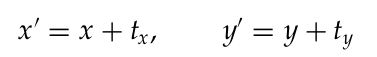
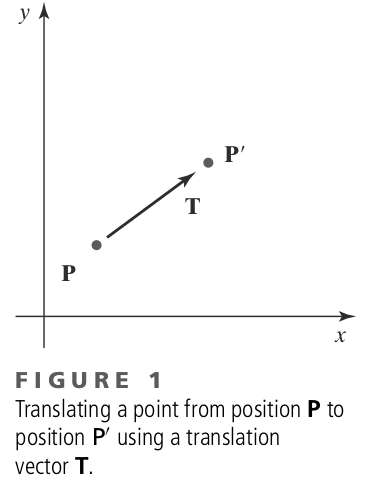

---

Translation distance pair _(tx, ty)_, is called **translation vector** or **shift vector**

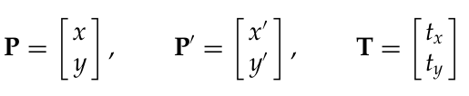

In matrix form:

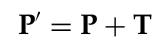

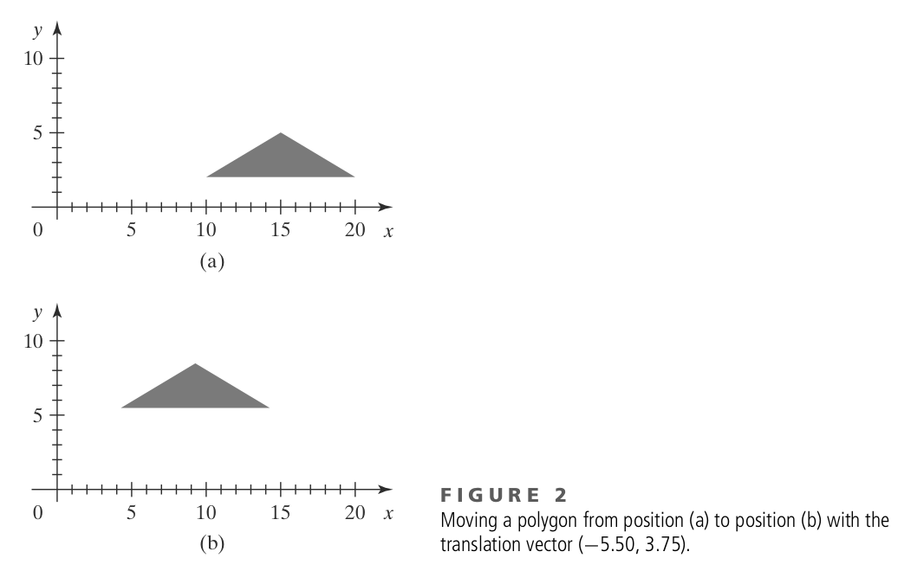

---

### Translation in code ([processing](./src/base.js))

```
class wcPt2D {
  public:
  GLfloat x, y;
};

void translatePolygon (wcPt2D * verts, GLint nVerts, GLfloat tx, GLfloat ty) {
  GLint k;
  for (k = 0; k < nVerts; k++) {
    verts [k].x = verts [k].x + tx;
    verts [k].y = verts [k].y + ty;
  }
  glBegin (GL_POLYGON);
    for (k = 0; k < nVerts; k++)
      glVertex2f (verts [k].x, verts [k].y);
  glEnd ( );
}
```

---

## Rotation

We generate a **rotation** transformation of an object by specifying a rotation axis and a **rotation angle**.

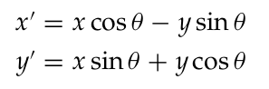
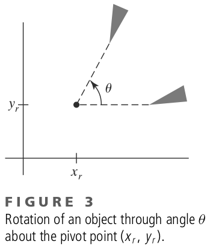

---

With column-vector representation:

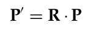

where rotation matrix is:

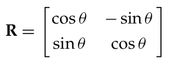


Rotation of a point about an arbitrary pivot:

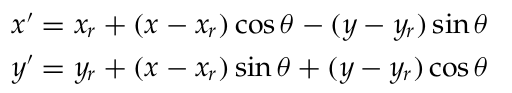

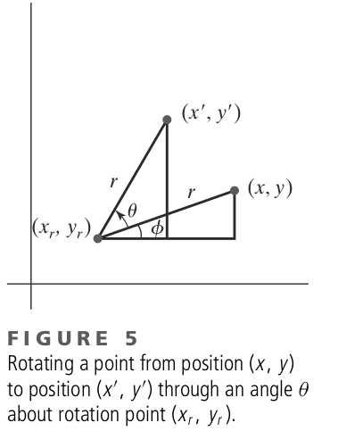

---

### Rotation in code ([processing](./src/base.js))

```
void rotatePolygon (wcPt2D * verts, GLint nVerts, wcPt2D pivPt, GLdouble theta) {
  wcPt2D * vertsRot;
  GLint k;
  for (k = 0; k < nVerts; k++) {
    vertsRot [k].x = pivPt.x + (verts [k].x - pivPt.x) * cos (theta)
    - (verts [k].y - pivPt.y) * sin (theta);
    vertsRot [k].y = pivPt.y + (verts [k].x - pivPt.x) * sin (theta)
    + (verts [k].y - pivPt.y) * cos (theta);
  }
  glBegin {GL_POLYGON};
    for (k = 0; k < nVerts; k++)
      glVertex2f (vertsRot [k].x, vertsRot [k].y);
  glEnd ( );
}
```

---


## Scaling

To alter the size of an object, we apply a **scaling** transformation.

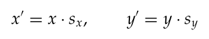
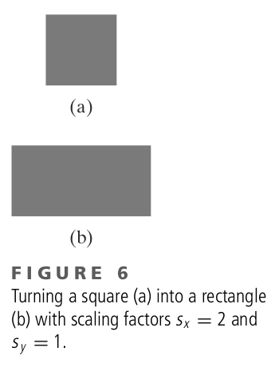

In matrix form:

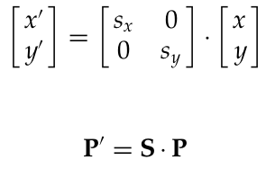

---

We can control the location of a scaled object by choosing a position, called the **fixed point**, that is to remain unchanged after the scaling transformation.

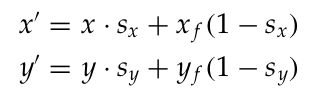

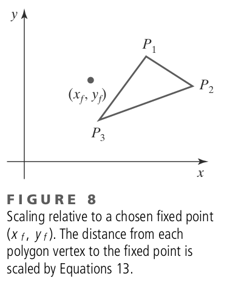

---

### Scaling in code ([processing](./src/base.js))

```
void scalePolygon (wcPt2D * verts, GLint nVerts, wcPt2D fixedPt, GLfloat sx, GLfloat sy)
{
  wcPt2D vertsNew;
  GLint k;
  for (k = 0; k < nVerts; k++) {
    vertsNew [k].x = verts [k].x * sx + fixedPt.x * (1 - sx);
    vertsNew [k].y = verts [k].y * sy + fixedPt.y * (1 - sy);
  }
  glBegin {GL_POLYGON};
    for (k = 0; k < nVerts; k++)
      glVertex2f (vertsNew [k].x, vertsNew [k].y);
  glEnd ( );
}
```

---


# Challenge: More transformations

Implement the **Reflection** (choose the one you like), **ShearX** and **ShearY** transformations

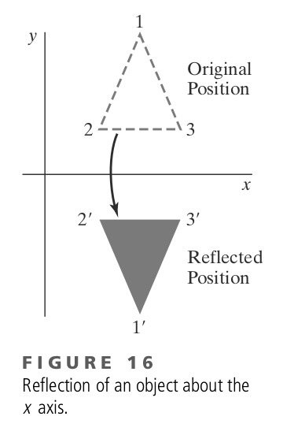

----

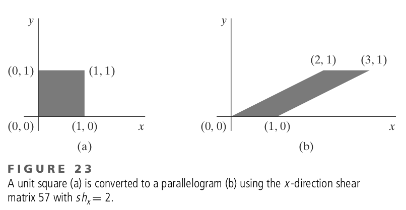
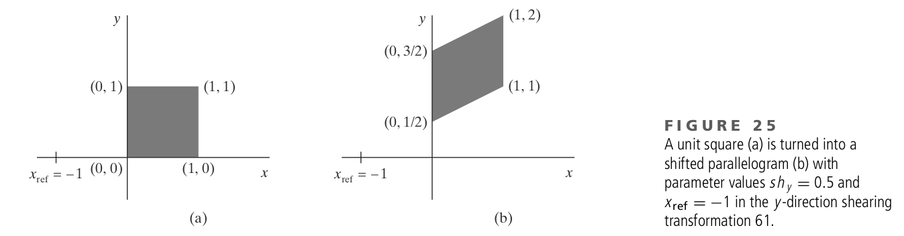


---

# What'next?

### Curves
### Surfaces
### Views
### Projections


---

# Resources and Credits
This material is genereated thanks to some extracts from following resources:

- **Computer Graphics with OpenGL** (Chapter 6) by _Donald D. Hearn/M. Pauline Baker, Warren Carithers_, 4th Edition


---

# Thanks

- **Obed N Muñoz Reynoso**
	- Cloud Software Engineer
	- obed.n.munoz@``gmail | tec | intel``.com
