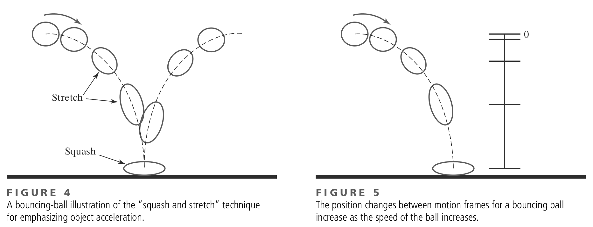

# **Simulation and Drawing process**
## Animation

https://talks.obedmr.com/

---

# Let's start with definitions

**Computer animation** refers to any time _sequence of visual changes_ in a picture. In addition to changing object positions using _translations_ or _rotations_, a computer-generated animation could display time variations in object _size_, _color_, _transparency_, or surface _texture_.

---

There are 2 types on methods to construct motion sequences:

- **Real-time animation**, where each stage of the sequence is _viewed as it is created_. It mus be _generated at a rate_ that is compatible with the constraints of the _refresh rate_.

- **frame-by-frame animation**, ach frame of the motion is _separately generated and stored_. Later, the frames can be _recorded on film_, or they can be _displayed consecutively_ on a video monitor in _“real-time playback”_ mode.

---

## Design of animation sequences (stages)

1. The **storyboard** is an outline of the action. It defines the motion sequence as a set of basic events that are to take place.

2. An **object definition** is given for each participant in the action. Objects can be defined in terms of basic shapes, such as polygons or spline surfaces.

3. A **key frame** is a detailed drawing of the scene at a certain time in the animation sequence. Within each key frame, each object (or character) is positioned according to the time for that frame.

---

4. **In-betweens** are the intermediate frames between the key frames. The total number of frames, and hence the total number of in-betweens, needed for an animation is determined by the display media that is to be used.

---

## Animation techniques

Film animators use a variety of methods for depicting and emphasizing motion sequences. These include object deformations, spacing between animation frames, motion anticipation and follow-through, and action focusing. Some traditional techniques are:

- squash and stretch
- timing
- anicipation
- Follow-through actions
- Staging

---

### Animation techniques (squash and stretch)

---

## Challenge: Bouncing-ball

We will implement an animation that will simulate a ball that is bouncing as shown in  **figure 4**

Your program will be showing 3 stages or scenes that will be transitioned by a mouse right-click

Consider the concepts you saw in class and also the following that could be useful:

_gravity, refresh-rate, object deformation, timing, real-time animation, curves drawing algorithms, color, texture, ..._

---

Below the 3 main stages or scenes of your program

- **Click 1** - _Define and draw_ your **ball's trajectory** and draw it. You can use 2 curves, one that is going down and one that is going up.

- **Click 2** - _Draw_ a summary of your **storyboard** based on figures 4 and 5. Only draw some selected frames that will provide a glimpse of your animation.

- **Click 3** - _Run_ your **ball-bouncing simulation**. Your ball will follow the pre-defined curved trajectories. Your ball will be deformed as it's going down/up.

---

# What's next

## - Collisions

---

# Resources and Credits
This material is genereated thanks to some extracts from following resources:

- **Computer Graphics with OpenGL** (Chapters 11) by _Donald D. Hearn/M. Pauline Baker, Warren Carithers_, 4th Edition

---

# Thanks

- **Obed N Muñoz Reynoso**
	- Cloud Software Engineer
	- obed.n.munoz@``gmail | tec | intel``.com
